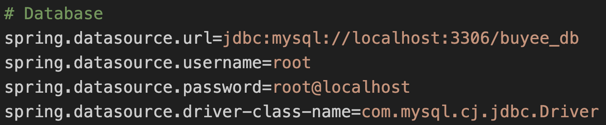
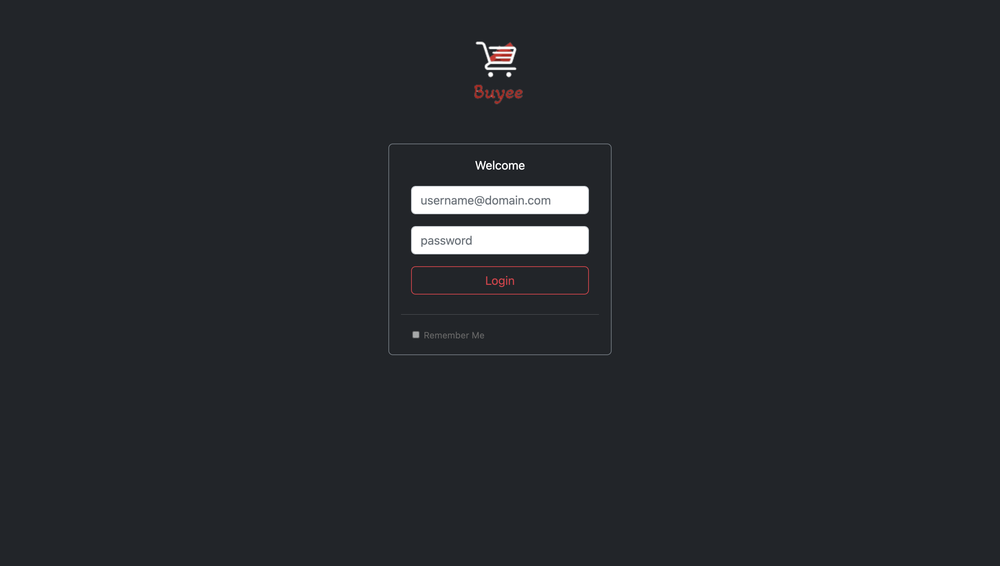

# springboot-ecommerce

E-Commerce website built with Spring Boot and Amazon S3

## 🤗 Author

Cheng Fei (Individual Project)

## 📋 Introduction

Buyee is an e-commerce platform with both toB and toC applications. It's a clone of the real-life amazon platform. The application is built with Spring Boot and Amazon S3, and deployed on Heroku.

## ✨ Overview

Frontend:


Backend:


## 💻 Technology Stack

Front-end: Thymeleaf (HTML), Bootstrap (CSS), jQuery (Javascript) </br>
Back-end: Spring Framework (Java) -- Spring Data JPA, Spring Security, Spring RESTful API </br>
Database: MySQL, Amazon S3 </br>
Deploy: Heroku

## 🔒 Authentication

The authentication system is secured with Spring Security framework. Users can only access modules open to their roles.

Users module requires Admin role <br />
Categories module requires Admin/Editor role <br />
Brands module requires Admin/Editor role

to be continued...

## ✏️ Usage

### Step 1: Database Setup

Set up a local MySQL database schema called `buyee_db` and replace the username and password in the `application.properties` file with your own MySQL username and password.



### Step 2: Run the Spring Boot Application

Please open the root folder buyee-app in an IDE and start the backend Spring Boot Application in the `buyee-web/buyee-backend` folder. Then please open the following URL:

```bash
open http://localhost:8080/buyee-admin
```

or start the frontend application in the `buyee-web/bu` folder. Then please open the following URL:

```bash
open http://localhost:80/buyee
```

### Step 3: Login

Then, you are in the login webpage. Please use the following admin account to login.



```bash
Username: test_user@test.com
Password: test2022
```

### Step X: Enjoy

Then please enjoy exploring the buyee e-commerce app!

## ☕ Buyee Me A Coffee

[](https://www.buymeacoffee.com/ChengaFEI)
